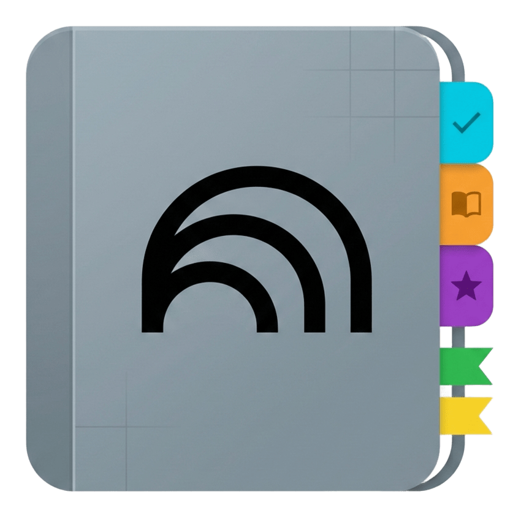

#  NotebookLM Tags

> A Chrome Extension to organize and tag your NotebookLM notebooks efficiently.

---


## Features

- **Custom Tags**: Create and assign colored tags to your NotebookLM notebooks.
- **Category Filtering**: Instantly filter your view on the NotebookLM dashboard to only show notebooks with specific tags.
- **Search & Filter Bar**: Injects a clean, native-feeling filter interface directly into the NotebookLM user interface.
- **Local Storage**: All tags and metadata are stored locally on your device via Chrome sync storage. No external servers or telemetry.
- **Import/Export**: Easily backup or migrate your organization system using JSON exports.


## Installation

### From the Chrome Web Store
*(Link pending)*

### Manual Installation (Developer Mode)

1. Download or clone this repository to your local machine:
   ```bash
   git clone https://github.com/codebytaha/notebooklm-tags.git
   ```
2. Open Google Chrome and navigate to `chrome://extensions/`.
3. Enable **Developer mode** using the toggle switch in the top right corner.
4. Click the **Load unpacked** button in the top left.
5. Select the directory where you cloned/extracted this repository.
6. The extension will now be installed and active when you visit [NotebookLM](https://notebooklm.google.com/).

## Usage

1. Open NotebookLM and ensure the extension is active.
2. Click the NotebookLM Tags extension icon in your Chrome toolbar to open the popup interface.
3. Use the popup to **Create Categories** and assign specific colors.
4. Select a category and add your **Notebooks** to it.
5. Native filter chips will now appear above your notebooks inside the NotebookLM dashboard interface.


## Development
 
```
notebooklm-tags/
├── logo.png          # Extension logo
├── manifest.json     # Chrome extension manifest
├── popup.html        # Extension popup UI
├── popup.js          # Popup logic
├── content.js        # Content script injected into NotebookLM
├── styles.css        # Styles for the extension
└── README.md         # Project documentation
```

---
## Contributing

Contributions are welcome! Feel free to:
- Open an [issue](https://github.com/codebytaha/notebooklm-tags/issues)
- Submit a [pull request](https://github.com/codebytaha/notebooklm-tags/pulls)

---

## License

MIT License

## Disclaimer

This extension is not affiliated with, endorsed by, or sponsored by Google LLC or NotebookLM. NotebookLM is a trademark of Google LLC.
